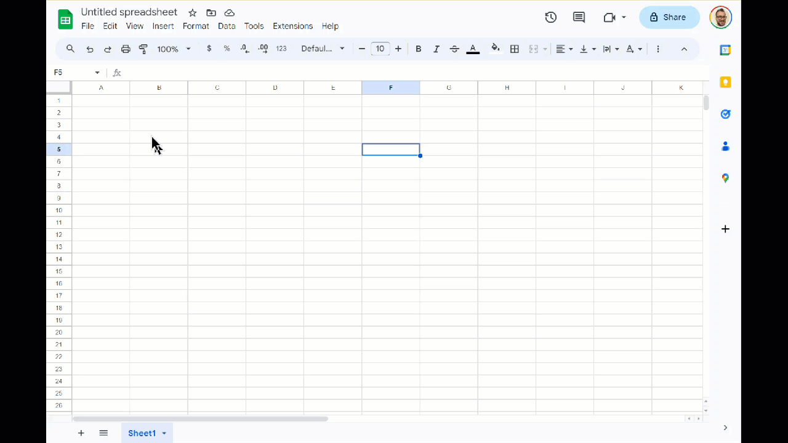

# Basic Data Structures Benchmark
Putting the Science in Computer Science

Objectives:
- Demonstrate the current efficiency of stack and queue by running benchmarks to collect data.
- Create two new classes that use a different backing implementation
- Compare the efficiency of the new classes to stack and queue by running benchmark tests to collect data.
- Analyze the results of your experiment.
- Summarize your findings.

## Step 1. Demonstrate the current efficiency of stack and queue

We have already seen in Chapter 2 of DS how we can use the time module and timeit to estimate how long a snippet of code takes to estimate. We also evaluated the python list data structure to verify that the order of magnitude for some operations plays out the way we theoretically expect it to. Since a Stack and Queue are both "backed" by a list, we theoretically expect that the methods of Stack and Queue should have similar growth patterns. Let's prove it.

For each of the methods in the Stack and Queue interface, demonstrate the growth rate by running a series of trials. These trials will be superficially similar to those conducted in Chapter 2. You will need to use the timeit module. Timeit is more complicated to use but extremely accurate. In the `built_ins` directory, you will find numbered examples from the book and separate `.py` files from the readme that you can build from. You will want to run each trial across a large range of numbers (e.g., 1,000,000 to 100,000,001 stepping by 1,000,000 or 10,000 to 1,000,001 stepping by 20,000). Printed output should clearly demonstrate the method's growth rate. You do not need to evaluate `__init__` for either data structure.

> Note that the version I've given differs slightly from what the book has. The included code utilizes the abc module, so Stack is a child class of AbstractStack and Queue is a child class of AbstractQueue. Similarly, all classes use the property decorator for is_empty() and size(), so don't use parentheses when you want to call these. This is to bring the classes more in line with what you've already learned and reinforce prior concepts. 

For each experiment (Stack vs Queue with lists), output the results to the terminal following the examples from the book to neatly organize the results by column:

```bash
n           is_empty      push       pop      peek      size
100            0.004     0.011     0.007     0.008     0.223
120            0.002     0.005     0.005     0.003     0.173
140            0.002     0.005     0.005     0.003     0.231
160            0.003     0.008     0.008     0.004     0.243
180            0.002     0.005     0.004     0.003     0.279
200            0.002     0.005     0.005     0.003     0.286
220            0.002     0.005     0.005     0.003     0.613
240            0.003     0.010     0.010     0.010     0.833
260            0.008     0.030     0.020     0.014     1.309
280            0.008     0.022     0.020     0.013     1.363
300            0.006     0.018     0.015     0.008     1.420
320            0.008     0.022     0.020     0.013     1.498
340            0.003     0.012     0.016     0.006     1.218
360            0.007     0.021     0.017     0.009     0.765
380            0.002     0.017     0.015     0.003     0.865
400            0.003     0.013     0.010     0.003     0.778
420            0.007     0.011     0.006     0.003     0.983
440            0.004     0.007     0.008     0.010     0.980
460            0.007     0.007     0.005     0.003     1.003
480            0.002     0.007     0.005     0.003     0.924
500            0.002     0.005     0.005     0.003     0.944
520            0.004     0.012     0.008     0.003     1.005
540            0.006     0.010     0.005     0.003     1.007
560            0.003     0.005     0.005     0.003     0.951
580            0.003     0.005     0.004     0.003     1.014
600            0.002     0.007     0.007     0.004     1.062
620            0.003     0.014     0.007     0.003     0.976
640            0.002     0.005     0.004     0.003     1.225
660            0.004     0.008     0.007     0.004     1.010
680            0.002     0.005     0.005     0.003     1.234
700            0.003     0.007     0.009     0.004     1.386
720            0.002     0.009     0.008     0.006     0.961
740            0.002     0.005     0.004     0.003     1.168
760            0.005     0.010     0.004     0.002     1.087
780            0.002     0.005     0.004     0.003     1.247
800            0.003     0.009     0.004     0.003     1.096
820            0.003     0.005     0.004     0.003     1.280
840            0.003     0.012     0.004     0.003     1.238
860            0.002     0.005     0.005     0.003     1.862
880            0.006     0.015     0.007     0.004     1.698
900            0.003     0.011     0.007     0.005     1.542
920            0.002     0.005     0.004     0.002     1.306
940            0.002     0.009     0.007     0.006     1.633
960            0.004     0.009     0.009     0.004     1.613
980            0.002     0.005     0.004     0.003     1.465
1,000          0.002     0.005     0.004     0.003     1.603
```

### The `timeit` module

The `timeit` module in Python provides a simple way to measure the execution time of small bits of Python code. It includes a `Timer` class that you can use to time the execution of a specific code snippet. The `Timer` class takes two main arguments: the statement you want to time and a setup statement that is executed once before the main statement.

Using `timeit` in Python offers a more accurate and precise method for measuring the execution time of code compared to manual time measurement using the `time` module. `timeit` provides a reliable timing mechanism, considers factors like system load, and delivers consistent results through automated multiple runs with statistical analysis. Its capability to handle setup code ensures fair comparisons and a controlled benchmarking environment. As a command-line tool, `timeit` facilitates quick script benchmarking without the need for code modifications. Integrated into the Python standard library, it serves as a widely-used and consistent solution for measuring code performance. Moreover, `timeit` provides results in microseconds (one millionth of a second), enabling fine-grained measurement crucial for micro-optimizations. 

Here are two examples demonstrating how to use `timeit.Timer`:

### Example 1: Timing a Simple Statement

```python
import timeit

# Example: Timing the execution of a simple statement
timer = timeit.Timer("result = 3 + 5")
execution_time = timer.timeit()
print(f"Execution Time: {execution_time} seconds")
```

In this example, the `timeit` module is used to measure the execution time of the statement `"result = 3 + 5"`. The `timeit()` method returns the time taken to execute the statement in seconds.

### Example 2: Timing a Function

```python
import timeit

# Example: Timing the execution of a function
def my_function():
    result = 0
    for i in range(1000000):
        result += i

timer = timeit.Timer("my_function()", setup="from __main__ import my_function")
execution_time = timer.timeit(1)  # Specify the number of executions (in this case, 1)
print(f"Execution Time: {execution_time} seconds")
```

In this example, the `timeit` module is used to measure the execution time of the `my_function` function. The `setup` argument is used to import the function into the timer's namespace. The `timeit(1)` method specifies that the function should be executed only once.

The `timeit` module is a versatile tool for benchmarking and measuring the performance of small code snippets, and it provides several options for fine-tuning the measurement process.


### Examples from the Book

I have also included several of the book examples (with small modifications) in the 'built_ins' directory. Of these, the `2_list_pop_range.py` and `3_dict_list_contains.py` files are the most useful because they show the pattern of ranges you need to test to observe the growth rate of each method. I **heavily** recommend you adapt this code for your own data collection tests.


## Step 2. Create Stack and Queue classes backed by a LinkedList

The current implementations provided by the book work. But, a Stack and a Queue can be implemented with other data structures backing them. Because we know that they provide benefits to problems where we need to access the ends of a sequential data structure but not the middle, we should take advantage of the Linked List ADT. The book provides a starting implementation for the Unordered Linked List ADT. It has been provided for you in this repository. But, this contains only a pointer to the head node. To truly take advantage of the linked list, you'll need to create your own implementation with a pointer to the tail node. This will be a child class of the current `UnorderedList.py` and you'll write it in a new file that you create called `TailList.py`. In addition to the head pointer, it will also track and preserve the tail. Your new class should override any method in the parent class that is relevant. You will have to determine which ones need implementations through careful analysis of the current implementation.

For this step, you will also need to create two new classes in two new files: `LinkedStack.py` and `LinkedQueue.py`. They should each implement all the current methods in the AbstractStack and AbstractQueue ADTs. It is not required that you complete the remaining methods in the Unordered List ADT - they have been done for you. Note that the implementation for the Node class has been slightly altered to fit the use of properties that we have been doing in class. Specifically, the version in this repo uses decorators, while the book uses a `property` method that achieves a similar effect but in a slightly different way. Also, ABCs have been created for you to inherit from - this will help ensure that your classes implement ALL required methods. 

Your goal is to write implementations of the Stack and Queue that demonstrate O(1) time complexity for the methods that add or remove to the stack/queue data structures. Remember - these methods will be VERY short, much like the current list-based implementation, they're really just wrapping up functionality already present in the backing data structure and making it fit the expected behavior of a Stack or Queue. Almost all of them will be 1 line.

## Step 3. Demonstrate the efficiency of your new classes

Just as in Step 1, collect data over a range of numbers to prove the time complexity of your new classes backed by a linked list. You will need to create two new files for this, but they will be almost exactly the same as what you created for the original Stack and Queue. Depending on how slow or fast the timeit tests run, you may need to adjust the range of inputs or the number of tests per method so that it's not stuck for hours (e.g., 100 -> 1001 by 20). 

## Step 4. Review your output files and draw some conclusions

Based on the data and implementation details, what is your estimation for the time complexity of the methods in Stack/Queue backed by Lists vs Stack/Queue backed by linked lists? Is one approach better than the other? Provide a brief writeup of your results in a file named 'results.md' in the top level directory of your repo. In this file, justify your explanation by providing big O for each of the methods. This will be your hypotheses for the time complexity.

For each of your tests, provide evidence of your findings by creating one or more charts that clearly show the growth rate you observed. My recommended method is by copying the output data from the terminal and pasting it into Google Sheets - from there you can split the text into columns and create a line chart of the results. If the O(n) obscures the relative similarity of the other O(1) methods, I recommend creating a second chart that excludes the O(n) method so that the other more efficient methods can be compared more directly.

If you don't know how to embed pictures into a md, you can look at the figure below in edit mode to get an idea. Just make sure you add all required images to the repo.


Fig. Data copied from the terminal is pasted into Google sheets. Then, the data is split into columns. A line chart is inserted, revealing one method that appears to be O(n). It is then removed so that a second chart can be created of the apparently O(1) methods. There is a bump in the amount of time taken, but it consistent across all methods and likely due to other demands on the processor. 

Finally, review your recorded hypotheses (the time complexity) and compare them to the data you collected. Include your thoughts about the outcome - why are the results what they are?

## Summary of Deliverables

In total, you will be creating three new classes in three new files:
1. TailList.py (List Directory)
2. LinkedStack.py (Stack Directory)
3. LinkedQueue.py (Queue Directory)

You will also be writing four programs to benchmark the two provided classes and create data for your four created classes:
1. stack_methods_data.py
2. queue_methods_data.py
3. linked_stack_methods_data.py
4. linked_queue_methods_data.py

And one prose writeup of your experimental results with pictures:
1. results.md
2. add any required images to the repo with local path

### Extra Credit

You have been provided with tests for all the classes you've been asked to write except for one - `TailList.py`. To get extra credit (and to ensure your implementation actually works) write your own `test_tail.py` file and include it in `\tests`. You'll need to write tests that demonstrate that all methods in the class work correctly.